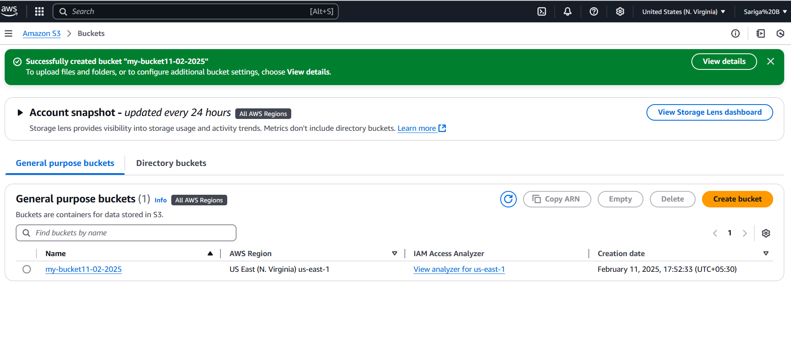
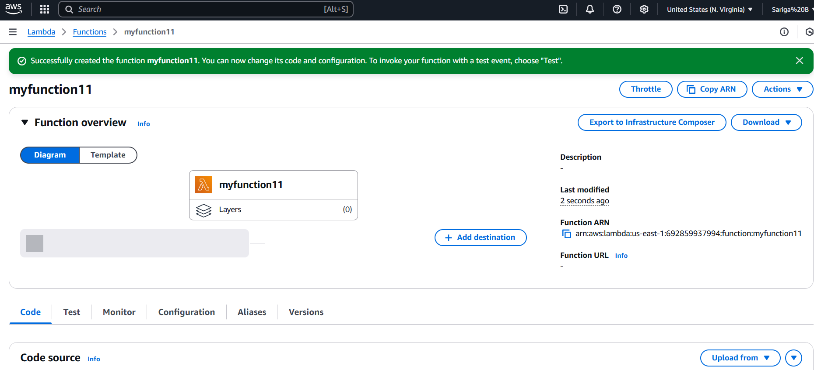
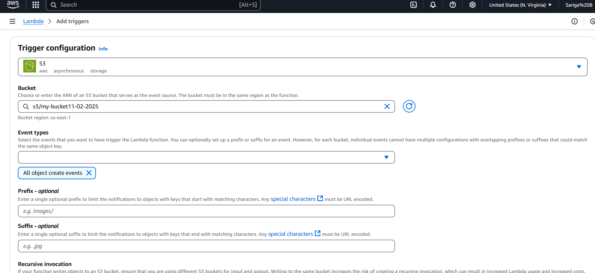
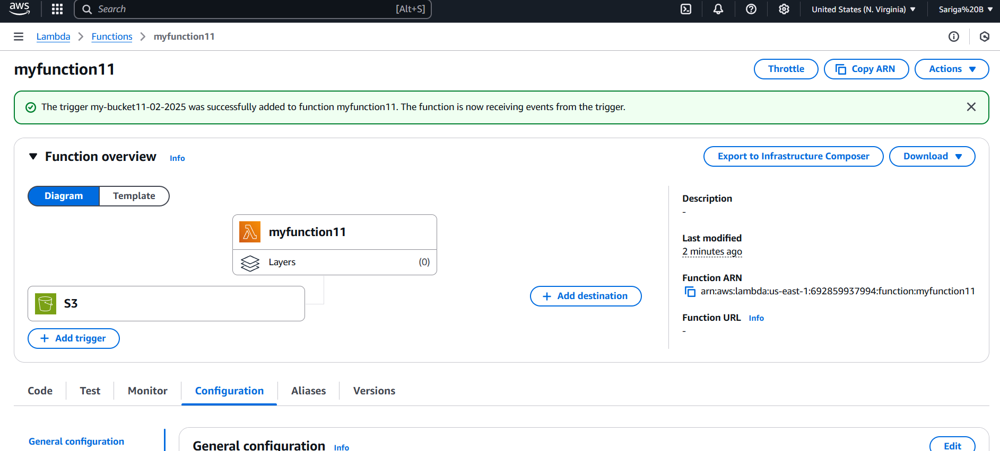
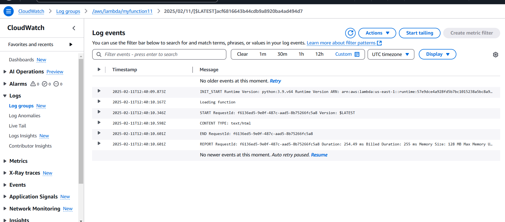

# Lambda-project
Steps of the project
1. Create a S3 bucket where need to uncheck “Block all public access”.
   
2. Create Lambda function and write lambda code.
   
3. Lambda Trigger.
   
4. upload html code in object and deploy lambda with S3 bucket.
   
6. Cloud watch metrics to monitor log streams related to S3 file Upload.
   
7. Log events.
   
